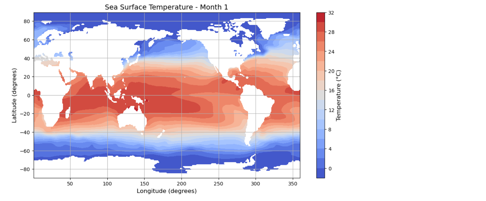

# 🌊 Sea Surface Temperature Contour Plot

This project visualizes global **Sea Surface Temperature (SST)** using NetCDF (.nc) data and Python. It includes data extraction, missing value handling, and a contour plot that illustrates temperature distribution across latitudes and longitudes. The analysis is part of an academic data exploration assignment.

---

## 📂 Dataset Info

- **Format**: NetCDF (.nc)
- **Dimensions**:
  - `lat`: 180 points
  - `lon`: 360 points
  - `time`: 12 months (Monthly data)
- **Variable Analyzed**: `sst` (Sea Surface Temperature)

---

## 📊 What This Project Includes

- ✅ Loading NetCDF file using `netCDF4`
- ✅ Extracting temperature, latitude, longitude
- ✅ Handling missing values using NumPy masking
- ✅ Creating a **contour plot** using `Matplotlib`
- ✅ Adding labels, title, and color bar
- ✅ Interpreting global SST patterns in a written PDF report

---

## 🧪 Technologies Used

- Python
- NumPy
- Matplotlib
- netCDF4

---

## 📸 Output Preview

> A contour plot visualizing SST for one month globally, showing warm equatorial waters and cooler polar regions.

  
*(Optional image — add this if you include a plot preview)*

---

## 📄 Files Included

| File Name                          | Description                                  |
|-----------------------------------|----------------------------------------------|
| `AmjadNazar_contourplot.py`       | Python code for processing and plotting SST  |
| `AmjadNazar_Analysis.pdf`         | 1-page analysis describing key findings       |
| `SeaSurfaceTemp.nc`               | NetCDF data file (not included in repo)       |

---

## 📌 Insights from the Analysis

- Warmest waters are concentrated around the equator.
- Cooler regions appear near the poles and certain ocean boundaries.
- Missing data in polar regions likely due to ice or lack of observations.
- The month used for visualization reflects seasonal asymmetry.

---

## 🎓 Author

**Amjad Nazar**  
📘 Computer Science Student  
📍 Sudan University of Science and Technology  
🔗 [LinkedIn](https://www.linkedin.com/in/amjad-nazar)  
🧪 Portfolio: [amjadnazar.github.io](https://amjadnazar.github.io)

---

## 📬 License

This project is for educational and academic purposes. Data belongs to the original source (NOAA COBE-SST2 dataset).
